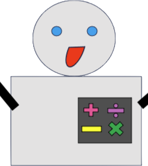

 

 

# Generative AI Basic Math Robot

## Description
This is an application that makes use of GCP's language generative AI API to interact with a AI that only knows basic math.

## Table of Contents
* [Requirements](#requirements)
* [Providers](#providers)
* [Inputs](#inputs)
* [Outputs](#outputs)
* [Installation](#installation)
* [Usage](#usage)
* [Remote Resources](#remote-resources)
* [License](#license)
* [Contributing](#contributing)

## Requirements

## Providers

## Installation
Needed to run:

Terraform: [download version .12 and above](https://www.terraform.io/downloads)

## Usage

To run the applications, resources must be created in a GCP cloud instance. You need to have a GCP account. While costs are kept low and are inside free tier, costs can be accrued. We are not responsible for the costs you may have.

A YAML file with all necessary permissions is included: custom_role_gcp.yaml. Create a role with all of the necessary permissions with this command:

     gcloud iam roles create mathRobot --project=PROJECT_ID --file=custom_role_gcp.yaml

Replace PROJECT_ID with your project ID.

Create a service account with this role attached to it. Create a key, and save the key in a secure place.

### For Terraform: 
Set environment variable for your service account in GCP with:

 export GOOGLE_APPLICATION_CREDENTIALS=<path_to_service_account_key.json>
 https://registry.terraform.io/providers/wiardvanrij/ipv4google/latest/docs/guides/provider_reference#running-terraform-outside-of-google-cloud

 If you want to run the whole process locally run in the root folder, replace arguments with correct values from your terraform.tfvars file:
 bash run_end_to_end_apply.sh "project_id" "project_number" "editor" \
 example:  bash run_end_to_end_apply.sh "test-project-785652" "56832145263" "thomassmith"

## Remote Resources

* Github: 

* Terraform Cloud: 

* GCP: 

## License
GNU AFFERO GENERAL PUBLIC LICENSE

## Contributing
No outside contributors allowed.

## Need to do
Least privilege SA account - take away vertex ai user
Have secrets be variablized w/in python
Secure the function

